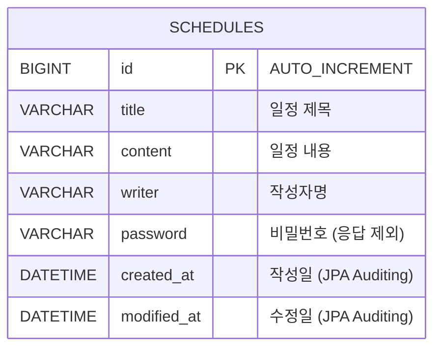

# 일정 관리 앱 (Schedule Management API)

Spring Boot와 JPA를 활용해 일정 데이터의 생성/조회/수정/삭제(CRUD)를 제공하는 REST API 서버입니다.
3 Layer Architecture(Controller - Service - Repository)를 적용했습니다.

## 기술 스택

- Java 17
- Spring Boot
- Spring Data JPA
- MySQL
- Lombok
- Gradle

## 주요 기능

- 일정 생성 (제목, 내용, 작성자명, 비밀번호)
- 일정 전체 조회 (작성자명 조건 검색 가능, 수정일 기준 내림차순 정렬)
- 일정 단건 조회
- 일정 수정 (제목, 작성자명만 수정 가능 / 비밀번호 검증)
- 일정 삭제 (비밀번호 검증)
- 작성일/수정일은 JPA Auditing으로 자동 관리
- 모든 API 응답에서 비밀번호 제외

---

## API 명세서

| 기능 | Method | URL | Request | Response | 상태 코드 |
|---|---|---|---|---|---|
| 일정 생성 | POST | /schedules | RequestBody | 생성된 일정 정보 | 201 Created |
| 일정 전체 조회 | GET | /schedules | Query Param (선택) | 일정 목록 | 200 OK |
| 일정 단건 조회 | GET | /schedules/{id} | Path Variable | 일정 단건 | 200 OK |
| 일정 수정 | PATCH | /schedules/{id} | Path Variable, RequestBody | 수정된 일정 정보 | 200 OK |
| 일정 삭제 | DELETE | /schedules/{id} | Path Variable, RequestBody | 없음 | 204 No Content |

### 1. 일정 생성

- **URL** : `POST /schedules`
- **설명** : 새로운 일정을 생성합니다. 일정 ID는 자동 생성되며, 작성일/수정일은 JPA Auditing으로 자동 저장됩니다. 최초 생성 시 수정일은 작성일과 동일합니다.

**Request Body**

```json
{
  "title": "Spring 과제하기",
  "content": "일정 관리 앱 필수 기능 구현",
  "writer": "최정윤",
  "password": "1234"
}
```

**Response** `201 Created`

```json
{
  "id": 1,
  "title": "Spring 과제하기",
  "content": "일정 관리 앱 필수 기능 구현",
  "writer": "최정윤",
  "createdAt": "2026-07-03T10:30:00",
  "modifiedAt": "2026-07-03T10:30:00"
}
```

### 2. 일정 전체 조회

- **URL** : `GET /schedules`
- **설명** : 등록된 일정 전체를 수정일 기준 내림차순으로 조회합니다. 작성자명(writer)을 쿼리 파라미터로 전달하면 해당 작성자의 일정만 조회합니다. 작성자명 조건은 선택 사항이며, 하나의 API로 처리합니다.

**Request 예시**

```
GET /schedules
GET /schedules?writer=최정윤
```

**Response** `200 OK`

```json
[
  {
    "id": 2,
    "title": "고양이 제목2",
    "content": "고양이 내용2",
    "writer": "최정윤",
    "createdAt": "2026-07-03T18:24:24",
    "modifiedAt": "2026-07-03T18:24:24"
  },
  {
    "id": 1,
    "title": "Spring 과제하기",
    "content": "일정 관리 앱 필수 기능 구현",
    "writer": "최정윤",
    "createdAt": "2026-07-03T10:30:00",
    "modifiedAt": "2026-07-03T10:30:00"
  }
]
```

### 3. 일정 단건 조회

- **URL** : `GET /schedules/{id}`
- **설명** : 일정 ID로 선택한 일정 단건을 조회합니다.

**Request 예시**

```
GET /schedules/1
```

**Response** `200 OK`

```json
{
  "id": 1,
  "title": "Spring 과제하기",
  "content": "일정 관리 앱 필수 기능 구현",
  "writer": "최정윤",
  "createdAt": "2026-07-03T10:30:00",
  "modifiedAt": "2026-07-03T10:30:00"
}
```

### 4. 일정 수정

- **URL** : `PATCH /schedules/{id}`
- **설명** : 선택한 일정의 제목과 작성자명을 수정합니다. 저장된 비밀번호와 요청 비밀번호가 일치해야 수정할 수 있습니다. 내용(content)과 작성일은 수정할 수 없으며, 수정일은 수정 시점으로 자동 갱신됩니다.
- 일부 필드만 수정하므로 PUT이 아닌 PATCH를 사용했습니다.

**Request Body**

```json
{
  "title": "Spring 과제 수정",
  "writer": "최정윤",
  "password": "1234"
}
```

**Response** `200 OK`

```json
{
  "id": 1,
  "title": "Spring 과제 수정",
  "content": "일정 관리 앱 필수 기능 구현",
  "writer": "최정윤",
  "createdAt": "2026-07-03T10:30:00",
  "modifiedAt": "2026-07-03T19:15:00"
}
```

### 5. 일정 삭제

- **URL** : `DELETE /schedules/{id}`
- **설명** : 선택한 일정을 삭제합니다. 저장된 비밀번호와 요청 비밀번호가 일치해야 삭제할 수 있습니다. 비밀번호를 URL에 노출하지 않기 위해 Request Body로 전달합니다.

**Request Body**

```json
{
  "password": "1234"
}
```

**Response** `204 No Content`

### 예외 응답

일정이 존재하지 않거나 비밀번호가 일치하지 않는 경우 요청이 거부됩니다.

| 상황 | 응답 |
|---|---|
| 존재하지 않는 일정 ID로 조회/수정/삭제 | 500 Internal Server Error (해당 일정이 존재하지 않습니다.) |
| 수정/삭제 시 비밀번호 불일치 | 500 Internal Server Error (비밀번호가 일치하지 않습니다.) |

비밀번호 검증에 실패하면 트랜잭션이 롤백되어 DB에는 어떤 변경도 발생하지 않습니다.

---

## ERD



필수 과제 범위에서는 일정(Schedule) 단일 테이블로 구성했습니다.

---

## 패키지 구조

```
com.sparta.basicschedule
 ├── common
 │    └── entity
 │         └── BaseEntity          # createdAt, modifiedAt 공통 관리 (JPA Auditing)
 └── schedule
      ├── controller
      │    └── ScheduleController  # HTTP 요청/응답 처리
      ├── service
      │    └── ScheduleService     # 비즈니스 로직, 비밀번호 검증
      ├── repository
      │    └── ScheduleRepository  # JPA 기반 DB 접근
      ├── entity
      │    └── Schedule            # schedules 테이블 매핑
      └── dto
           ├── ScheduleSaveRequest
           ├── ScheduleSaveResponse
           ├── ScheduleGetAllResponse
           ├── ScheduleUpdateRequest
           └── ScheduleDeleteRequest
```

## 구현 시 신경 쓴 부분

- **Entity와 DTO 분리** : Entity를 그대로 반환하지 않고 Response DTO를 별도로 두어, 비밀번호가 API 응답에 노출되지 않도록 했습니다.
- **JPA Auditing** : BaseEntity에 `@CreatedDate`, `@LastModifiedDate`를 적용해 작성일/수정일을 자동 관리하고, `@Column(updatable = false)`로 작성일 변경을 막았습니다.
- **Dirty Checking** : 수정 API에서 `save()`를 호출하지 않고, 트랜잭션 안에서 조회한 엔티티의 필드만 변경해 JPA의 변경 감지로 UPDATE가 실행되도록 구현했습니다.
- **수정 가능 필드 제한** : Entity의 `update()` 메서드가 title, writer만 파라미터로 받도록 설계해, 내용(content)이 수정되는 실수를 구조적으로 차단했습니다.
- **검증 로직의 위치** : 비밀번호 검증은 비즈니스 규칙이므로 Controller가 아닌 Service에서 수행하고, 비교 로직 자체는 Entity의 `isPasswordMismatch()` 메서드로 두어 수정/삭제에서 재사용했습니다.
- **조건부 조회 단일화** : 작성자명 검색을 별도 API로 분리하지 않고 `@RequestParam(required = false)`로 하나의 전체 조회 API에서 처리했습니다.
